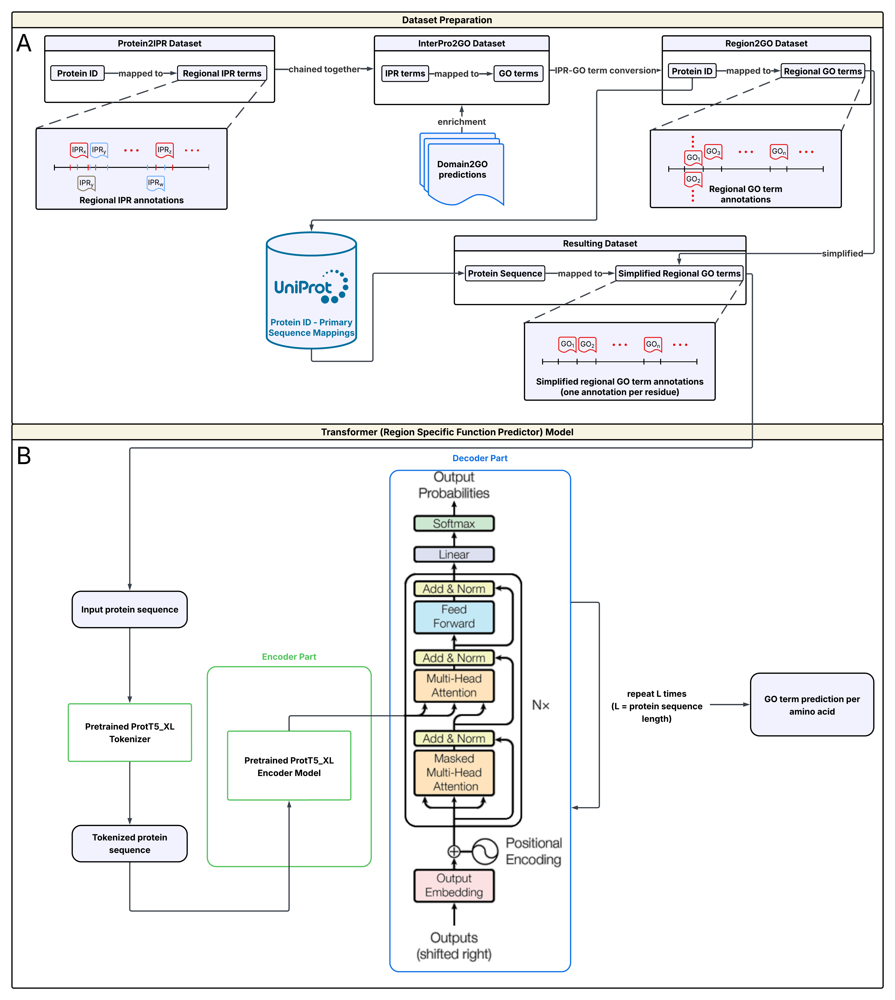

# TransPRSFP: Machine Translation-Based Protein Region-Specific Function Prediction


It is essential to know the functions of proteins to comprehend biological mechanisms and to make effective biomedical research possible. Although Gene Ontology (GO) serves as a common annotation methodology for gene/protein functions, manually curating them takes a considerably long time. While fine-grained domain-level GO annotations constitute a significant resource type for biomedical research, the curation of them involves much more difficulty. Moreover, existing research focuses more on protein-level annotations than on region-level annotations. Therefore, aiming primarily for the region-level annotations, we propose TransPRSFP, a transformer encoder-decoder-based model to generate region-specific GO-term annotations from primary sequences of proteins. In our proposed method, each amino acid and each GO-term is considered a token in source and target languages, respectively. As for the dataset structure, for each amino acid token, there exists either a corresponding GO-term annotation or the empty token. To create such a dataset, Protein2IPR and InterPro2GO datasets were chained together to realise the transition from amino acids to GO-term annotations at the residue level. TransPRSFP utilises the GPT-2 architecture with cross-attention layers, successfully capturing the complex contextual relationships. It performs as many forward propagations as the length of the input protein sequence to accomplish its task (Figure 1B). The model was evaluated via comprehensive metrics, which primarily measure the accuracy of localisations, and shown to be significantly effective for regional protein function prediction, with regional and protein-level F1-score measurements averaging at more than 0.86 and 0.92, respectively (Table 1).


**Figure 1.** **(A)** Protein2IPR and InterPro2GO datasets are utilised together to generate the train-test dataset. Domain2GO predictions are also used to enrich InterPro2GO data. **(B)** The proposed architecture uses a pretrained ProtT5_XL encoder model to use as input the embeddings of an input protein sequence, performing as many forward propagations as the length of the input protein sequence.

**Table 1.** The precision, recall, F1-score, match ratio, nonempty (NE) match ratio, token-based (TB) precision, recall, F1-score, and accuracy metrics calculated as results of tests conducted on each main GO class: BP, MF, and CC.

| Class | Epoch | Prec. | Recall | F1    | Match Ratio | NE Match Ratio | TB-Prec. | TB-Recall | TB-F1 | TB-Acc. |
| :---: | :---: | :---: | :----: | :---: | :---------: | :------------: | :------: | :-------: | :---: | :-----: |
| BP    | 101   | 0.912 | 0.890  | 0.897 | 0.860       | 0.843          | 0.828    | 0.843     | 0.829 | 0.851   |
| MF    | 176   | 0.961 | 0.955  | 0.955 | 0.923       | 0.917          | 0.914    | 0.917     | 0.912 | 0.916   |
| CC    | 173   | 0.924 | 0.918  | 0.920 | 0.882       | 0.854          | 0.846    | 0.854     | 0.843 | 0.879   |

While precision, recall, and f1 metrics were calculated on the protein level, considering the predictions and annotations as assigned to the whole protein, the token-based counterparts of them were calculated on a token-by-token basis, which means that the predictions were evaluated on the amino acid level, focusing on the localisation performance. The match ratio was calculated by counting the number of token predictions that are predicted correctly, divided by the total number of predicted tokens, while the nonempty match ratio measures the explained ratio for the regions where the ground-truth label involves a GO-term annotation.

The Python script provided in this repository makes it possible to train the proposed model and perform predictions using pre-trained models.

## Getting Started
The recommended Python version is 3.8.10 since the script has been tested by using this version.

To create a clean virtual environment, use the following command:
```bash
$ python3 -m venv virtual_env
```

Then, activate the virtual environment by using the following command:
```bash
$ source virtual_env/bin/activate
```

After activating the virtual environment, in the directory where the requirements_torch.txt and requirements.txt files reside, execute the following commands to install the required modules (Note that you might need to modify the requirements_torch.txt file based on your CUDA version):

```bash
$ pip install -r requirements_torch.txt
$ pip install -r requirements.txt
```

## Usage

The script has been developed to train and evaluate the proposed model architecture. Hence, it can be used to:
 - Train TransPRSFP, either
   - from scratch,
   - from a checkpoint, i.e., a pretrained model
- Perform inference, with/without
   - reporting the metrics that are referred to in the abstract of the study

Note: The [ProtT5-XL-UniRef50](https://github.com/agemagician/ProtTrans) encoder model is required for all the usages outlined above. You can download it using the following link: [https://drive.google.com/file/d/1PnPtgdzkopjdjNS6XMLhjyS9bioMT2Kq/view?usp=sharing](https://drive.google.com/file/d/1PnPtgdzkopjdjNS6XMLhjyS9bioMT2Kq/view?usp=sharing)

You can extract the encoder model folder from the archive using the following command:
```bash
$ tar xvf Rostlab_prot_t5_xl_uniref50.tar.xz
```

To see the usage of the script, the following command can be executed:
```bash
$ python3 main.py -h
```

The output of this command is as follows:
```bash
usage: main.py [-h] [-i] [-t] [-d DEVICE] -dp DATASET -mt {transformer,classification_head,gpt2,merged} [-tmt {transformer,gpt2}] [-mp MODEL_PATH] -t5 PROT_T5_MODEL_PATH
               [-th THRESHOLD] [-bs BATCH_SIZE] [-e EPOCH] [-lr LEARNING_RATE] [-msd MODEL_SAVE_DIR] [-spe SAVE_PER_EPOCH] [-ml MAX_LENGTH] [-tdr TRAINING_DATASET_RATIO]
               [-tbld TENSORBOARD_LOG_DIR] [-chmp CLASSIFICATION_HEAD_MODEL_PATH] [-tmp TRANSFORMER_MODEL_PATH] [-rn RUN_NAME] [-gti GO_TERM_INDEX] [-lgti LOAD_GO_TERM_INDEX]
               [-s RANDOM_SEED] [-ns] [-cfp CONTINUE_FROM_CHECKPOINT] [-gtmfp GO_TERM_METRICS_FILEPATH_PREFIX] [-cm] [-stst SAVE_TRAINING_SET_TO] [-stest SAVE_TEST_SET_TO]

optional arguments:
  -h, --help            show this help message and exit

arguments:
  -i, --inference       If it is given, the model is set to run in inference mode
  -t, --train           If it is given, the model will be trained
  -d DEVICE, --device DEVICE
                        the device on which the model is to run
  -dp DATASET, --dataset DATASET
                        path to dataset (must be a pickle-saved binary file)
  -mt {transformer,classification_head,gpt2,merged}, --model-type {transformer,classification_head,gpt2,merged}
  -tmt {transformer,gpt2}, --transformer-model-type {transformer,gpt2}
                        required only if the merged model is used
  -mp MODEL_PATH, --model-path MODEL_PATH
                        path to the directory where the model is saved
  -t5 PROT_T5_MODEL_PATH, --prot-t5-model-path PROT_T5_MODEL_PATH
                        path to the directory where ProtT5 model is stored
  -th THRESHOLD, --threshold THRESHOLD
                        threshold for classification head model. The less the threshold, the more the number of false positives, but the less the number of false negatives. The more
                        the threshold, the less the number of false positives, but the more the number of false negatives.
  -bs BATCH_SIZE, --batch-size BATCH_SIZE
                        batch size
  -e EPOCH, --epoch EPOCH
                        number of epochs for training
  -lr LEARNING_RATE, --learning-rate LEARNING_RATE
                        learning rate for training
  -msd MODEL_SAVE_DIR, --model-save-dir MODEL_SAVE_DIR
                        the folder path to save the model(s) (must be non-existent)
  -spe SAVE_PER_EPOCH, --save-per-epoch SAVE_PER_EPOCH
                        if set to a positive value, each x epochs, the model is saved to the model save dir specified in the arguments
  -ml MAX_LENGTH, --max-length MAX_LENGTH
                        the maximum length for a protein sequence. If not set, automatically inferred from the dataset
  -tdr TRAINING_DATASET_RATIO, --training-dataset-ratio TRAINING_DATASET_RATIO
                        the ratio of the number of samples in training data to the number of samples in all dataset (must be between 0 and 1, 0 and 1 excluded)
  -tbld TENSORBOARD_LOG_DIR, --tensorboard-log-dir TENSORBOARD_LOG_DIR
                        the folder where the tensorboard logs are to be saved (must be non-existent)
  -chmp CLASSIFICATION_HEAD_MODEL_PATH, --classification-head-model-path CLASSIFICATION_HEAD_MODEL_PATH
                        path to the classification head model (only used in merged model type)
  -tmp TRANSFORMER_MODEL_PATH, --transformer-model-path TRANSFORMER_MODEL_PATH
                        path to the transformer model (only used in merged model type)
  -rn RUN_NAME, --run-name RUN_NAME
                        the name identifying this run
  -gti GO_TERM_INDEX, --go-term-index GO_TERM_INDEX
                        the file path to save GO term index (must be non-existent)
  -lgti LOAD_GO_TERM_INDEX, --load-go-term-index LOAD_GO_TERM_INDEX
  -s RANDOM_SEED, --random-seed RANDOM_SEED
                        random seed
  -ns, --no-random-seed
                        if specified, no constant will be set as random seed
  -cfp CONTINUE_FROM_CHECKPOINT, --continue-from-checkpoint CONTINUE_FROM_CHECKPOINT
                        path to a checkpoint of the model to be trained
  -gtmfp GO_TERM_METRICS_FILEPATH_PREFIX, --go-term-metrics-filepath-prefix GO_TERM_METRICS_FILEPATH_PREFIX
                        the prefix of filenames to save GO term-based metrics. If not specified, a random string will be generated. This option can only be used in inference mode
  -cm, --compute-metrics
                        If it is given, task-specific metrics will be computed and reported. This can be used only in inference mode. If the provided dataset does not properly
                        include the corresponding true labels, the execution will fail and terminate at an early stage
  -stst SAVE_TRAINING_SET_TO, --save-training-set-to SAVE_TRAINING_SET_TO
                        the path to save the training set. The specified path must be non-existent. This option can only be used in training mode
  -stest SAVE_TEST_SET_TO, --save-test-set-to SAVE_TEST_SET_TO
                        the path to save the test set. The specified path must be non-existent. This option can only be used in training mode
```

## Datasets
- In order to access the datasets that have been used to train the TransPRSFP, the following link can be used: [https://drive.google.com/drive/folders/1nc6t26bOn_ghUX8nHctAP8bZ1qIOEbJv?usp=sharing](https://drive.google.com/drive/folders/1nc6t26bOn_ghUX8nHctAP8bZ1qIOEbJv?usp=sharing)


## Models
- In order to access the pre-trained models, the following link can be used: [https://drive.google.com/drive/folders/1S5pxEx0fXqB7lgSW8QFV5pwWyFAWFJbm?usp=sharing](https://drive.google.com/drive/folders/1S5pxEx0fXqB7lgSW8QFV5pwWyFAWFJbm?usp=sharing)

## Dataset Format
 - This script uses the datasets prepared in a specific format and saved as a binary object file using the pickle module.
 - Below, sample datasets consisting of toy examples are given for illustrating the required dataset formats. For viewing the dataset(s), you should download it and use the built-in pickle module in Python as follows (You can first open a Python shell and execute the following lines):
   ```python
   >>> import pickle
   >>> with open("test_annotated_dataset.pkl", "rb") as f:
   >>>     dataset = pickle.load(f)
   >>> dataset
   ```
 - To examine the dataset format for training the model, please use the following link: [test_annotated_dataset.pkl](https://drive.google.com/file/d/1KANwdXEeaCJ32kR93p9OW7JeJlvlGPJm/view?usp=sharing)
 - To examine the dataset format for running the model in inference mode, please use the following link: [test_dataset.pkl](https://drive.google.com/file/d/18XZn3gH-NWcEGPi-CUObHy02Hy8u-AqC/view?usp=sharing). Note that the format of the dataset file named as test_annotated_dataset.pkl is also applicable for running the model(s) in inference mode, and compulsory if the metrics are to be computed. In the case where the GO term annotations are not known, the format of the file test_dataset.pkl must be used.

To get acquainted with the usage of the script, it is recommended that you download the sample datasets specified above and use them to test the script by using the commands specified below.

## Using the Script to Train the Model from Scratch

A sample command for using the script to train the model from scratch is as follows:
```bash
$ CUDA_VISIBLE_DEVICES=0 python3 main.py --train --device cuda --dataset ../test_annotated_dataset.pkl --model-type gpt2 -t5 ../Rostlab_prot_t5_xl_uniref50 --model-save-dir ../transprsfp_training_test --go-term-index ../transprsfp_training_test_go_term_index.pkl --batch-size 24 --epoch 150 --learning-rate 0.00001 --training-dataset-ratio 0.8 --max-length 1000
```

Executing this script by using the command above means that the **gpt2-based** model will be **trained** according to the following specifications:
 - the device **cuda:0** will be utilised throughout the training
 - the dataset found at relative path **../test_annotated_dataset.pkl** will be used
 - the T5Encoder model found at relative path **../Rostlab_prot_t5_xl_uniref50** will be used
 - the model will be saved at relative path **../transprsfp_training_test** per epoch (note that the saved model will be overwritten at each time the new checkpoint is saved). Also, tensorboard logs of the training are regularly saved at the **../transprsfp_training_test/runs** directory
 - the batch size **24** will be applied
 - the training will last for **150** epochs
 - the learning rate is **0.00001** (note that the linear learning rate decay is applied)
 - **80%** of the dataset will be used as the training set, while the rest being the test set.
 - the protein sequences will be truncated to a maximum of **1000** amino acids in length.

To train the model on the biological process dataset from scratch by using the same parameters as those that are used in scope of this research for, e.g., 150 epochs, the following command can be executed:
```bash
$ CUDA_VISIBLE_DEVICES=0 python3 main.py --train --device cuda --dataset ../datasets/bp.pkl --model-type gpt2 -t5 ../Rostlab_prot_t5_xl_uniref50 --model-save-dir ../transprsfp_bp --go-term-index ../transprsfp_bp_go_term_index.pkl --batch-size 24 --epoch 150 --learning-rate 0.00001 --training-dataset-ratio 0.95 --max-length 1000
```
Note that you might need to decrease the batch size depending on your GPU's available memory amount. The training can also be performed on CPU by specifying the **--device** as **cpu**. However, this would take much longer time, and thus, is not recommended.


## Using the Script to Train the Model from a Checkpoint

A sample command for using the script to train the model from a checkpoint is as follows:
```bash
$ CUDA_VISIBLE_DEVICES=0 python3 main.py --train --device cuda --dataset ../test_annotated_dataset.pkl --model-type gpt2 -t5 ../Rostlab_prot_t5_xl_uniref50 --model-save-dir ../transprsfp_training_test_continued --continue-from-checkpoint ../transprsfp_training_test/checkpoint-10/ --load-go-term-index ../transprsfp_training_test_go_term_index.pkl --batch-size 24 --epoch 150 --learning-rate 0.00001 --training-dataset-ratio 0.8 --max-length 1000
```

Executing this script by using the command above means that the **gpt2-based** model will be **trained** according to the following specifications:
 - the device **cuda:0** will be utilised throughout the training
 - the dataset found at relative path **../test_annotated_dataset.pkl** will be used
 - the T5Encoder model found at relative path **../Rostlab_prot_t5_xl_uniref50** will be used
 - the model will be saved at relative path **../transprsfp_training_test_continued** per epoch (note that the saved model will be overwritten at each time the new checkpoint is saved). Also, tensorboard logs of the training are regularly saved at the **../transprsfp_training_test_continued/runs** directory
 - the training will start from the checkpoint saved at the relative path ../transprsfp_training_test/checkpoint-10/, and the GO-term index of the checkpoint model is at the relative path ../transprsfp_training_test_go_term_index.pkl
 - the batch size **24** will be applied
 - the training will last for **150** epochs
 - the learning rate is **0.00001** (note that the linear learning rate decay is applied)
 - **80%** of the dataset will be used as the training set, while the rest being the test set.
 - the protein sequences will be truncated to a maximum of **1000** amino acids in length.

To continue training the model on the biological process dataset from a checkpoint, i.e., the provided pre-trained model for the BP category, by using the same parameters as those that are used in scope of this research for, e.g., 150 epochs, the following command can be executed:
```bash
$ CUDA_VISIBLE_DEVICES=0 python3 main.py --train --device cuda --dataset ../datasets/bp/bp.pkl --model-type gpt2 -t5 ../Rostlab_prot_t5_xl_uniref50 --model-save-dir ../transprsfp_bp_continued --continue-from-checkpoint ../transprsfp_bp/ --load-go-term-index ../transprsfp_bp/go_term_index.pkl --batch-size 24 --epoch 150 --learning-rate 0.00001 --training-dataset-ratio 0.95 --max-length 1000
```
Note that you might need to decrease the batch size depending on your GPU's available memory amount. The training can also be performed on CPU by specifying the **--device** as **cpu**. However, this would take much longer time, and thus, is not recommended.

## Using the Script to Perform Inference

A sample command for using the script to perform inference, i.e., predict residue-level GO-term annotations, is as follows:

```bash
$ CUDA_VISIBLE_DEVICES=0 python3 main.py --inference --device cuda --model-type gpt2 --model-path ../transprsfp_training_test/checkpoint-10/ --load-go-term-index ../transprsfp_training_test_go_term_index.pkl -t5 ../Rostlab_prot_t5_xl_uniref50 --dataset ../test_dataset.pkl
```

Executing this script by using the command above means that the **gpt2-based** model found at relative path **../transprsfp_training_test/checkpoint-10/** will be **run** in **inference** mode according to the following specifications:
 - the device **cuda:0** will be utilised
 - the T5Encoder model found at relative path **../Rostlab_prot_t5_xl_uniref50** will be used
 - inference will be performed on the dataset found at relative path **../test_dataset.pkl**

Also, the metrics can be computed by using the **--compute-metrics** switch:
```bash
$ CUDA_VISIBLE_DEVICES=0 python3 main.py --inference --device cuda --model-type gpt2 --model-path ../transprsfp_training_test/checkpoint-10/ --load-go-term-index ../transprsfp_training_test_go_term_index.pkl -t5 ../Rostlab_prot_t5_xl_uniref50 --dataset ../test_annotated_dataset.pkl --compute-metrics
```
Notice that the dataset being used is **../test_annotated_dataset.pkl** this time as it is necessary to provide an annotated dataset for the computation of metrics.

### Reproducing the Results in Table 1
It is possible to reproduce the results provided in Table 1 by executing the following commands for BP, MF, and CC classes, respectively.

To be able to get the same results as in Table 1, you need to make sure that you have downloaded the pre-trained models from the link provided in the **Models** section and that you are providing the script with the correct paths to the models. Also, the corresponding test sets should be downloaded from the link provided in the **Datasets** section and used accordingly, taking into account the GO categories on which the inference is performed.

#### Biological Process (BP)
```bash
$ CUDA_VISIBLE_DEVICES=0 python3 main.py --inference --device cuda --model-type gpt2 --model-path ../transprsfp_bp/ --load-go-term-index ../transprsfp_bp/go_term_index.pkl -t5 ../Rostlab_prot_t5_xl_uniref50 --dataset ../datasets/bp/bp_test.pkl --max-length 1000 --compute-metrics
```

#### Molecular Function (MF)
```bash
$ CUDA_VISIBLE_DEVICES=0 python3 main.py --inference --device cuda --model-type gpt2 --model-path ../transprsfp_mf/ --load-go-term-index ../transprsfp_mf/go_term_index.pkl -t5 ../Rostlab_prot_t5_xl_uniref50 --dataset ../datasets/mf/mf_test.pkl --max-length 1000 --compute-metrics
```

#### Cellular Component (CC)
```bash
$ CUDA_VISIBLE_DEVICES=0 python3 main.py --inference --device cuda --model-type gpt2 --model-path ../transprsfp_cc/ --load-go-term-index ../transprsfp_cc/go_term_index.pkl -t5 ../Rostlab_prot_t5_xl_uniref50 --dataset ../datasets/cc/cc_test.pkl --max-length 1000 --compute-metrics
```

## References
 - Ulusoy E, Doğan T. Mutual annotation-based prediction of protein domain functions with Domain2GO. Protein Sci. 2024 Jun;33(6):e4988. doi: 10.1002/pro.4988. PMID: 38757367; PMCID: PMC11099699.
 - Ünlü, A., & Çevrim, E., & Doğan, T. (2024). Prot2Mol: Target based molecule generation using protein embeddings and SELFIES molecule representation. GitHub. https://github.com/HUBioDataLab/Prot2Mol
 - https://www.youtube.com/watch?v=U0s0f995w14
 - https://towardsdatascience.com/a-detailed-guide-to-pytorchs-nn-transformer-module-c80afbc9ffb1
 - https://medium.com/the-dl/transformers-from-scratch-in-pytorch-8777e346ca51
 - https://towardsdatascience.com/how-to-code-the-transformer-in-pytorch-24db27c8f9ec
